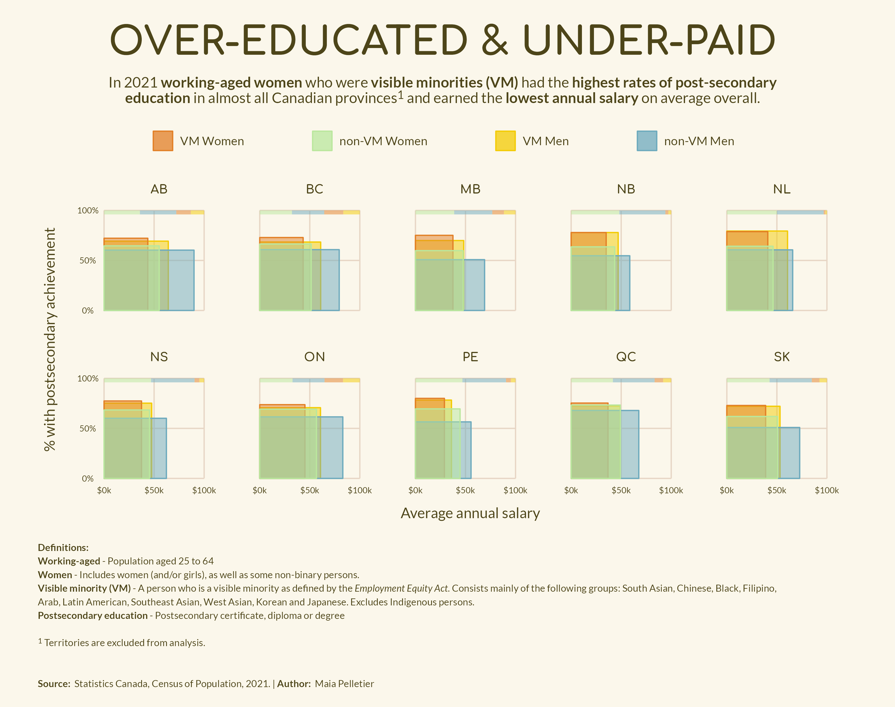

# DigitALL Data Visualization Challenge  

My entry for the IWD data viz challenge looks at the gap between income and education in Canadian women and men who are both visible minorities and not visibile minorities. I chose to include the census "visible minority" dimension in my analysis because often in the discussion of the wage gap, racialized women are left out of the discussion. In terms of income, on average these women are even more under-paid than women who do not belong to a racialized group.  

I acknowledge that my visualization leaves a lot of context out of the picure - my goal was to paint a broad picture of education and income across gender and demographic dimensions. There is a lot more nuance that I didn't have the time to cover! The biggest thing to note here is that the "visibile minority" definition excludes Indigenous popuations, which means they are included in the non-visible minority population.  

And on that note... this is overall a rough visualization. I would love to improve/polish it given more time :) 

